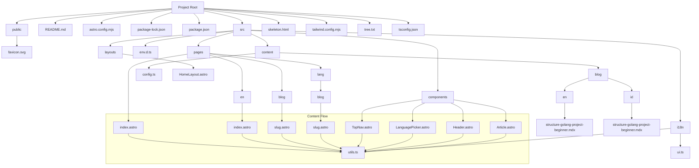

# Overview

The "Sabar" project is a static personal blog site built using Astro.js with TypeScript, integrated with TailwindCSS, MDX, and deployed on Vercel. It supports basic internationalization (i18n) with content available in Indonesian (default) and English.

# Installation

```bash
git clone https://github.com/wahyusa/sabar.git
cd sabar
npm install
npm run dev
```

# Folder structure

Generated by `tree -I 'node_modules|.git' > tree.txt` in Linux/WSL environment

<details>
<summary>Click to expand!</summary>
  
```code
Project Root
├── README.md
├── astro.config.mjs
├── package-lock.json
├── package.json
├── public
│   └── favicon.svg
├── skeleton.html
├── src
│   ├── components
│   │   ├── Article.astro
│   │   ├── Header.astro
│   │   ├── LanguagePicker.astro
│   │   └── TopNav.astro
│   ├── content
│   │   ├── blog
│   │   │   ├── en
│   │   │   │   └── structure-golang-project-beginner.mdx
│   │   │   └── id
│   │   │       └── structure-golang-project-beginner.mdx
│   │   └── config.ts
│   ├── env.d.ts
│   ├── i18n
│   │   ├── ui.ts
│   │   └── utils.ts
│   ├── layouts
│   │   └── HomeLayout.astro
│   └── pages
│       ├── [lang]
│       │   └── blog
│       │       └── [...slug].astro
│       ├── blog
│       │   └── [...slug].astro
│       ├── en
│       │   └── index.astro
│       └── index.astro
├── tailwind.config.mjs
└── tsconfig.json
```

</details>


# Diagram

Hope I can still understand this when I touch this project again in future



# Usage Scenario

TLDR


Pages and content **not** within a `[lang]` directory are for the **default** language, Indonesian.

English-specific content and pages reside in the `/en/` directory or inside `[lang]`.


## Home Page

Default Indonesian page: `example.com`

File Source: `src/pages/index.astro`


English page: `example.com/en`

File Source: `src/pages/en/index.astro`

## Blog Page

Default Indonesian: `example.com/blog/structure-golang-project-beginner`

File Source: `src/pages/blog/[...slug].astro`

MDX Content: `src/content/blog/id`


English: `example.com/en/blog/structure-golang-project-beginner`

File Source: `src/pages/[lang]/blog/[...slug].astro`

MDX Content: `src/content/blog/en`


# END
